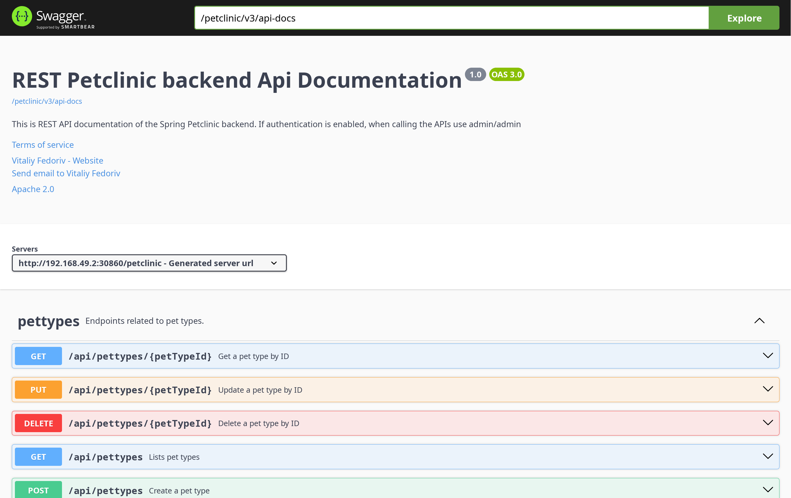

1. Compare the application logs before and after you exposed it as a Service. Try to open the app several times while the proxy into the Service is running. What do you see in the logs? Does the number of logs increase each time you open the app?
Ya, jelas ada perbedaan. saat sebelum saya attached ke dalam service, berarti deployment belum diexpose oleh service. sehingga kita tidak dapdat serta merta megnaksesnya. oleh karena itu saat coba dilihat dalam logs nya, kita menemui sebuah kekosongan. maksudnya, hanya ada persiapan untuk port port yang akan digunakan, namun loggin masih belum tersedia alias belum ada logging endpoint mana saja yang diakses. setelah saya tambahkan service, saya bisa melihat terdapat logs yang memberitahu diamna saja endpoint yang telah diakses oleh seorang user, dalam koneteks ini adalah saya sendiri. endpoint tersebut ada dua (yang diakses oleh user alias saya sendiri) yaitu get ke root /, sebagai penjelasan bahwa setelah saya exposed servicenya minikube atau kubernetes langsung mempopup sebuah window browser saya yang mengakses root endpoint, dan saya new tab lagi membuka root edpoint lagi. hal ini menjadi penjelasan mengapa terdapat dua log endpoint root yang diakses melalui method get. selanjutnya saya coba nyalakan kebali service nya dan saya coba akses edpointnya berkali kali, dan dapat dilihat bahwa setiap endpoint dikunjuungi akan terdapat lognya. hal ini setelah saya coba berkali kali, bisa dilihat terdapat banyak log tentang sesuorang dalam hal ini saya sendiri yang menakses ednpoint root. jadi logging endpoint root dipanggil ada banyak. berikut saya sertakan fotonya atau tangkapan layar eksperimen saya kali ini secara terurut.

2. Notice that there are two versions of `kubectl get` invocation during this tutorial section. The first does not have any option, while the latter has `-n` option with value set to `kube-system`. What is the purpose of the `-n` option and why did the output not list the pods/services that you explicitly created?
Sebetulnya ini ya bukan seuah hal yang kompleks ya. -n itu adalah kata kunci dari namespace, jadi kalau tidak ada -n ya namespacenya namespace untuk default namespace alias user, sedangkan kalau ada -n dan valuenya kube-system itu namespacenya adalah namespace dari sistem kubernetes itu sendiri. dalam arti dia akan menampilkan semua pods dari namespace kube-system

========================================== YANG TERAKHIRRRR =======================================================
1. What is the difference between Rolling Update and Recreate deployment strategy?
Rolling Update dan Recreate merupakan dua pendekatan berbeda dalam melakukan deployment di Kubernetes. Rolling Update memperbarui aplikasi secara bertahap dengan menggantikan pod lama satu per satu dengan pod baru, sehingga layanan tetap berjalan dan tidak mengalami gangguan selama proses berlangsung. Sebaliknya, strategi Recreate menghentikan seluruh pod lama terlebih dahulu, lalu meluncurkan pod baru, yang mengakibatkan downtime namun memastikan hanya satu versi aplikasi yang aktif dalam satu waktu.

2. Try deploying the Spring Petclinic REST using Recreate deployment strategy and document your attempt.
reset dan start

buat deployment

scaling 4 replika

rubah strategi rolling update pada spec.strategy
`
strategy:
    type: Recreate
`
coba deploy

sanity check

3. Prepare different manifest files for executing Recreate deployment strategy.

path = simpan sesukanya

4. What do you think are the benefits of using Kubernetes manifest files? Recall your experience in deploying the app manually and compare it to your experience when deploying the same app by applying the manifest files (i.e., invoking kubectl apply -f command) to the cluster.
dengan manifest file, kita bisa menyimpan konfigurasi sesuai yang kita inginkan, dengan itu kita dapat menghemat banyak waktu dan tenanga daripada melkukan edit manual, plus kita bisa melakukan deploying secara langsung.
